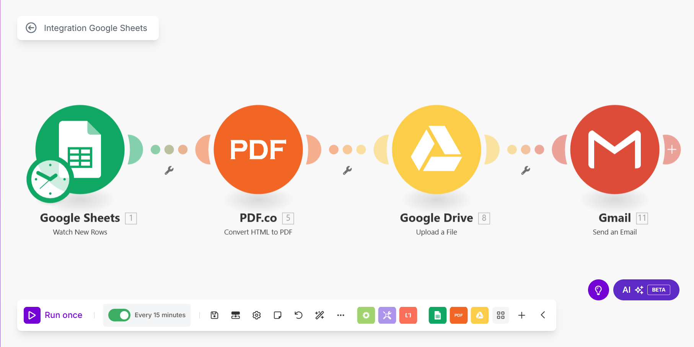

# 🚀 Client Onboarding Automation (Make.com)

A fully no-code automation project built with [Make.com](https://www.make.com) to simplify client onboarding — from collecting form responses to sending a welcome email with a generated PDF.

---

## 🔧 Tools Used

- **Google Forms** – To collect client data  
- **Google Sheets** – To store responses  
- **Make.com** – To automate the process  
- **PDF.co** – To generate personalized PDFs  
- **Gmail** – To email clients automatically  

---

## 🔁 Workflow Overview

1. Client submits information through Google Form  
2. Data is stored in a connected Google Sheet  
3. Make.com detects new row entry  
4. The scenario:
   - Generates a PDF using PDF.co  
   - Sends an email via Gmail with the PDF attached  
   - (Optional) Saves the PDF to Google Drive  

---

## ⭐ Key Features

- 🔄 Fully automated process  
- 🧾 Custom HTML-based PDF template  
- 🧠 No coding required  
- 📈 Scalable for teams or solo use  
- ✅ Easy to replicate and reuse

---

## 🖼 Scenario Snapshot

> 📷 Visual representation of the Make.com automation scenario.



---

## 📂 Folder Structure

```
client-onboarding-automation/
├── README.md
├── make-scenario.md
├── pdf-template.html
├── .env.example
└── assets/
    └── workflow-diagram.png
```

---

## 📥 How to Use

1. Clone this repository  
2. Set up your `.env` file based on `.env.example`  
3. Customize the `pdf-template.html` as needed  
4. Rebuild the scenario in Make.com  
5. Test the entire flow using your Google Form

---

## 📄 License

This project is open-source and intended for educational/demo purposes.  
Feel free to use, fork, and modify as needed.
